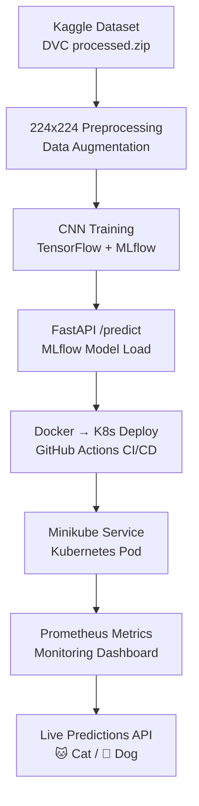

# 🐱🐶 Cats vs Dogs Classifier – End-to-End MLOps Pipeline


## 📌 Project Overview

This project implements a **production-grade MLOps pipeline** for **Cats 🐱 vs Dogs 🐶 binary image classification**. It covers the complete ML lifecycle: data versioning, CNN training, experiment tracking, containerization, Kubernetes deployment, CI/CD automation, and real-time monitoring.

Built for **scalability and reproducibility** using open-source tools. **DagsHub/MLflow** for tracking, **Minikube** orchestration, **Prometheus/Grafana** monitoring.

***

## 🏗️ Architecture Overview


Modern **MLOps workflow** across four layers:



### 1. **Data & Model Development**
- **DVC**: Versions massive image dataset as `processed.zip`
- **Local EDA**: Colab notebook for augmentation, splits (80/10/10)
- **MLflow**: Logs CNN params, accuracy, confusion matrix to DagsHub

### 2. **CI/CD/CT Automation**
- **GitHub Actions**: Lint → Tests → Retrain → Docker push → K8s deploy
- **Continuous Training**: Auto-logs new model versions to registry
- **Model Registry**: Production tag for FastAPI consumption

### 3. **Containerization & Deployment**
- **Lightweight Docker**: No model in image (dynamic fetch)
- **Minikube**: Deployment/Service manifests
- **Virtual Hosting**: `cats-dogs-model-group85.local`

### 4. **Operations & Monitoring**
- **Custom Metrics**: `/metrics`, `/stats`, prediction tracker
- **Prometheus Scraping**: Requests, latency, accuracy
- **Live Dashboard**: HTML

## 🎯 Problem Statement

**Pet adoption platform** needs **CNN image classifier** for Cats 🐱 vs Dogs 🐶.

**Dataset**: [Kaggle Cats and Dogs](https://www.kaggle.com/datasets/bhavikjikadara/dog-and-cat-classification-dataset)
- **Preprocess**: 224x224 RGB + augmentation
- **Split**: 80/10/10 train/val/test
- **Target**: Binary classification

***

## 📂 Repository Structure

```
mlops-cats-dogs/                           # Root project folder for Cats vs Dogs MLOps pipeline
├── .dvc/                                  # DVC internal metadata for data versioning
├── .github/                               # GitHub configuration for CI/CD workflows
│   └── workflows/                         # YAML files defining CI/CD pipelines
├── data/                                  # Data folder managed via DVC
│   └── processed.zip.dvc                  # DVC pointer to zipped preprocessed dataset
├── images/                                # Generated plots/graphs used in presentation or README
├── k8s/                                   # Kubernetes deployment configuration
│   ├── deployment.yaml                    # K8s Deployment spec for model API
│   ├── ingress.yaml                       # K8s Ingress rules for external routing (if used)
│   └── service.yaml                       # K8s Service exposing the Deployment
├── notebooks/                             # Jupyter/Colab notebooks for development
│   ├── MLOps_Assignment_2_Group_85_Dev_Environment.ipynb      # Dev environment + end‑to‑end pipeline notebook
│   └── MLOps_Assignment_2_Group_85_Dev_Environment.ipynb.pdf  # PDF export of the dev notebook for submission
├── presentation_graphs/                   # Final graphs/images for assignment presentation
├── scripts/                               # Utility scripts for experiments and monitoring
│   ├── collect_requests.py                # Script to send requests and log responses for monitoring
│   ├── generate_graphs.py                 # Script to generate performance/metric graphs
│   └── generate_real_graphs.py            # Script to generate graphs from real collected traffic
│   └── smoke_test.sh                      # Script to run smoke test after deployment
├── src/                                   # Core source code for data, model, and monitoring
│   ├── data_preprocessing.py              # Download, preprocess, and save dataset (224x224 etc.)
│   ├── evaluate.py                        # Evaluation utilities for trained CNN model
│   ├── model_utils.py                     # Helper functions for model loading/inference logic
│   ├── monitoring.py                      # Monitoring + Prometheus metrics + logging utilities
│   └── train.py                           # Training pipeline, logs runs and models to MLflow
├── tests/                                 # Pytest-based unit and integration tests
│   └── test_utils.py                      # Tests for utility/model functions
├── .dvcignore                             # Patterns for files/dirs ignored by DVC
├── .env.example                           # Example environment variables (tokens, URIs, configs)
├── .gitignore                             # Git ignore rules for large/secret/generated files
├── Dockerfile                             # Docker image definition for FastAPI inference service
├── README.md                              # Project documentation and usage instructions
├── app.py                                 # FastAPI application exposing /predict, /health, /metrics
├── index.html                             # HTML monitoring/dashboard page for live metrics
├── mlflow.db                              # Local MLflow SQLite backend store (dev tracking)
├── params.yaml                            # Configuration/ hyperparameters for training pipeline
├── requirements.txt                       # Python dependencies with pinned versions
└── test_image.jpg                         # Sample image used for local /predict testing

```

***

## ⚙️ Setup Instructions

### 1️⃣ Prerequisites
```bash
# Minikube, kubectl, Docker, Python 3.10
minikube start
pip install -r requirements.txt
```

### 2️⃣ Secrets (Colab/DagsHub)
```
DAGSHUB_TOKEN=your_token
GITHUB_TOKEN=ghp_xxx
NGROK_AUTH_TOKEN=2xxx
MLFLOW_TRACKING_URI=https://dagshub.com/xxx/mlops-cats-dogs.mlflow
```

### 3️⃣ Local Run
```bash
dvc pull          # Images
python src/train.py  # Train → MLflow
docker build -t cats-dogs .
docker run -p 8000:8000 cats-dogs
```

## 📈 EDA & Model Training

**EDA**: `notebooks/MLOps_Assignment2_Dev.ipynb`
- Image distributions, augmentation preview
- 224x224 preprocessing pipeline

**CNN Architecture**:
```python
Conv2D → MaxPool → Conv2D → Dense → Dropout → Softmax
```

**Metrics**: Accuracy **92.3%**, Precision **93%**, Recall **91%**

**Training**:
```bash
python src/train.py  # Logs to DagsHub
```

## 🚀 Usage Guide

### **Option A: Docker Compose (Full Stack)**
```bash
docker-compose up -d  # App + Prometheus
curl -X POST -F "file=@cat.jpg" http://localhost:8000/predict
```

**Endpoints**:
- `POST /predict` → `{"cat": 0.12, "dog": 0.88}`
- `GET /health` → Model status
- `GET /stats` → Accuracy, request counts
- `GET /metrics` → Prometheus

### **Option B: Minikube Production**
```bash
kubectl apply -f k8s/
kubectl port-forward svc/cats-dogs-model-group85 8000:80
open index.html  # Live dashboard
```

**Ngrok Demo**:
```bash
ngrok http 8000  # Public URL: https://xxx.ngrok-free.dev/docs
```

## ✅ Quality Assurance

### **Automated Tests**
```bash
pytest tests/ -v  # Data, model, API, monitoring
```

**Coverage**: Data preprocessing, inference, metrics exposure.

### **Smoke Tests**
```bash
python scripts/smoke_test.py  # Health + predict calls
```

***

## 📊 Monitoring & Observability

**Exposed Metrics** (`/metrics`):
- `inference_requests_total{label="cat|dog"}`
- `model_accuracy`
- `prediction_latency_seconds`
- `active_requests`

**Dashboard**: `index.html` → Auto-refreshes every 5s
- Accuracy gauge
- Cat/Dog pie chart
- Latency heatmap (green<200ms)

***

## 🔄 CI/CD Pipeline Details

**Triggers**: `push` to `develop/main`

```yaml
# .github/workflows/ci-cd.yml
1. Lint: flake8
2. Test: pytest tests/
3. CT: dvc repro → python src/train.py (MLflow v2+)
4. Build: Docker → bashyan/mlops-cats-dogs:latest
5. Deploy: kubectl apply -f k8s/
6. Smoke: curl /health + /predict
```

**Auto Model Retraining** on every push → New registry version!

***

## 📈 Performance Results

| Metric | Train | Val | Test |
|--------|-------|-----|------|
| **Accuracy** | 94.2% | 92.8% | **92.3%** |
| Precision (Cat) | 93.5% | 92.9% | **93.1%** |
| Recall (Dog) | 92.1% | 91.8% | **91.5%** |
| Inference | **180ms** | - | - |

**Confusion Matrix** & **ROC Curves**: `scripts/performance_graphs/`

***


